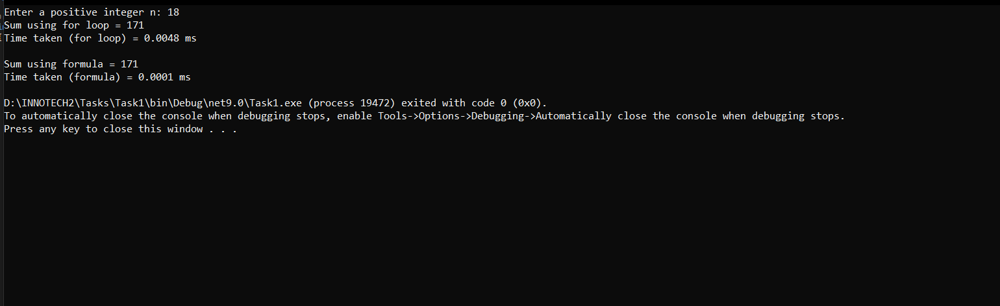

# Tasks
✅ Task 1 – Sum of Numbers from 1 to n
Objective:
Write a program that calculates the sum of numbers from 1 to n.
Compare performance between using a for loop and a mathematical formula.

🔧 Requirements:
Accept a positive integer n from the user.

Validate that n is a positive integer.

Calculate the sum using:

A for loop

The formula: sum = n * (n + 1) / 2

Measure and compare the CPU time for both approaches.

---------------------------------------------------------------------------------------------------------------------------------------------------------------------------------------------

✅ Task 2 – Printing Numbers from 1 to n (Comma-Separated)
Objective:
Write a program that prints numbers from 1 to n, separated by commas, without a trailing comma at the end.

🔧 Requirements:
Accept a positive integer n from the user.

Validate that n is a positive integer.

Print numbers from 1 to n, separated by commas.

Ensure no trailing comma after the last number.

Implement the solution using StringBuilder for better performance.

Analyze the time complexity of the solution.

